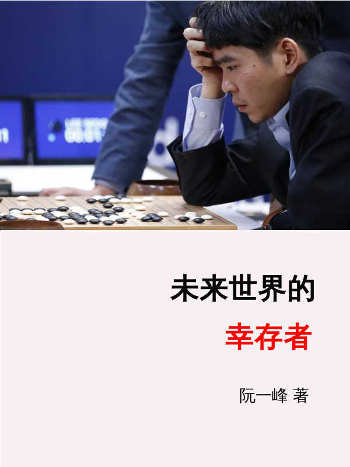

2016年3月，谷歌公司的围棋程序 AlphaGo 战胜了世界冠军李世石。

这让我猛然意识到，世界正处在一个前所未有的大变局：

> **机器人、自动化、人工智能正在变得比人类更强大。**
>
> **在可预见的将来，技术最终将淘汰人类。**

技术变革导致了人类社会的重构。绝大部分的人没机会参与这个进程，只能被动接受其他人安排自己的命运，而且没有改变命运的机会，就像我在[《穷忙的人生》](http://survivor.ruanyifeng.com/collapse/working-poor.html)一文所写的。

> “总的来看，下一代青年不太可能像上一代有那么多机会。经济增长已经开始放缓，还将继续放缓；人口增长高峰已经过去；除了高科技，几乎所有行业都不会有以前那么高的增长率。现在是穷人，未来极大可能还是穷人，能翻身的只能是少数，而且难度越来越大。”

当时，我在《财新周刊》有一个专栏，就把一些想法写在里面，每个月一篇，一共有20几篇。这本书就是专栏的结集，再加上一些以前的旧文（全在第三章）。

世界正在猛烈变化，旧的模式完全行不通了。我希望这本书，能让读者意识到洪水就在不远处，从而早早准备出路。

