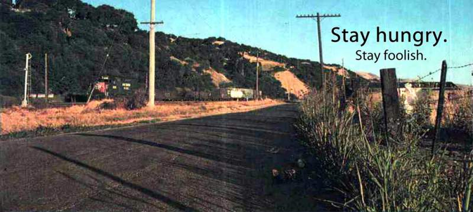

# Stay hungry, Stay foolish 的原义

乔布斯在斯坦福大学毕业演讲中说过，他最喜欢的一句话叫做”Stay hungry, Stay foolish“。

> ”Stewart和他的人出了好几期《地球产品目录》（Whole Earth Catalog），然后不打算再出了，他们推出了最后一期。那时是70年代中期，我跟你们一样大。
>
> 那一期的封底有一张照片，上面是清晨的乡间道路，就是那种如果你喜欢漫游，你会经过的道路。照片下面有一句话：‘Stay Hungry, Stay Foolish’。这是他们的临别赠言。
>
> Stay Hungry, Stay Foolish. 我总是希望自己永远保持这个状态。
>
> 现在你们即将毕业，我也把这句话送给你们。“

这句话一下子就出名了，乔布斯的人生格言，谁会忘记呢？

可是，它到底是什么意思，就众说纷纭了。有人就去采访《地球产品目录》的创始人和主编 Stewart Brand，问他知不知道乔布斯喜欢他的这句话。下面就是我想分享的内容。

> ”对，我知道乔布斯中意这句话。因为他托人传话，他想要一份我的签名，在那一期 Stay Hungry, Stay Foolish 的封面上。这是我第一次知道，这本杂志对他很重要。”

哇，想象一下，乔布斯问你要签名，这会是什么感觉啊……

Stewart Brand 接着就解释，这句话是怎么来的。

> “1966年，我发起了一个 the whole Earth 运动，想要 NASA 公布地球的太空照片，后来《地球产品目录》的名字就是这样来的。”

1958年，美国发射了第一颗人造卫星“探险者1号”，可是直到1966年，都没有公布地球的太空照片，全世界都不知道太空中看地球是什么样子。所以，就有了 Stewart Brand 的 the whole Earth 运动。

1968年12月29日，阿波罗8号拍摄了地球从月球的地平线上升起。那次航行是人类第一次完整地拍摄地球。人类有了第一批地球的太空照片。

> “后来，我们就拿到了地球的太空照片，那是在一颗卫星上拍摄的，可以看到地球的完整一天，从日出到日落。我把照片排成那个顺序，我想表达一种连接，一方面是太阳的阴影在地球表面的移动，另一方面是与此同时人们在地球上的经历，他们看到日出。
>
> 我脑海中的画面是，一个漫游者日出时站在无名的路上，太阳升起来了，火车从旁边呼啸而过。这个年轻人的心情是如此自由，他有点饿（hungry），也知道得很清楚，自己对前面的道路一无所知（foolish）。”

下面就是这张封底图片。读完上面这段话，再结合实物，你就会明白 Stay hungry，Stay foolish 到底是什么意思，以及它为什么能打动20岁的乔布斯，30年后还记得清清楚楚。

